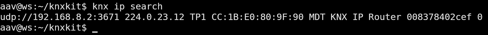
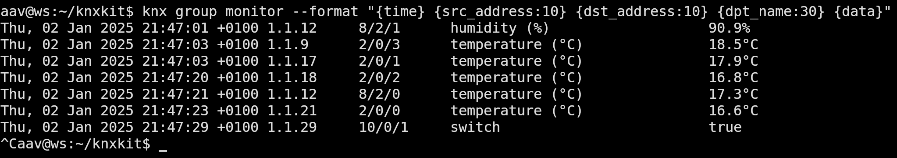

# High-level API for KNX devices and networks
__knxkit__ is a library for interfacing with [KNX](https://www.knx.org) devices and networks. It provides a high-level API for interacting with KNX devices and networks, and is designed to be easy to use and flexible.

- __Data structures__ — individual and group addresses, CEMI, APDU, DPT, DataPoint, KNXnet/IP frames

- __KNXnet/IP services__ — search, describe, tunneling are implemented.

- __Project files__ — read _.knxproj_ files, which are used by ETS to store KNX project information. Devices and group definitions can be extracted.

- __Data point structures__  generated from knx_master.xml contents. Typed and generic representations are supported

- __Command line__ utilities for data structures generation and knx network interaction.


### Code Example
```toml
[dependencies]
tokio = { version = "1.42.0", features = ["full"] }
knxkit = "0.1.1"
knxkit_dpt = "0.1"
```

```rust
use std::{net::Ipv4Addr, str::FromStr, time::Duration};

use knxkit::{
    connection::{self, ops::GroupOps, KnxBusConnection, RemoteSpec},
    core::address::GroupAddress,
};

use knxkit_dpt::{
    specific::{SpecificDataPoint, DPT_9_1},
    typeinfo,
};

#[tokio::main]
async fn main() {
    let remote = RemoteSpec::KnxIpTunnel("192.168.8.2:3671".parse().unwrap());
    let local = Ipv4Addr::from_str("192.168.7.51").unwrap();

    let mut tunnel = connection::connect(local, &remote).await.unwrap();

    let group = GroupAddress::from_str("2/0/0").unwrap();
    let timeout = Duration::from_secs(1);

    let data_point = tunnel.group_read(group, timeout).await.unwrap();

    let temp = DPT_9_1::from_data_point(&data_point).unwrap();
    let info = typeinfo::lookup(DPT_9_1::DPT).unwrap();

    println!("{}: {}{}", info.text.unwrap(), temp.0, info.unit.unwrap());
    // -> temperature (°C): 19.5°C

    tunnel.terminate().await
}
```

### Command line utility example
```shell
cargo install knxkit_cli
export KNX_REMOTE=udp://192.168.8.2
export KNX_PROJECT=~/knxkit/_hidden/etc/TestProject.knxproj
```

Search


Group Monitor


Downloadable binary releases for Linux (and maybe Windows) will be provided in the future.

### Related crates
  - [knxkit_dpt](https://crates.io/crates/knxkit_dpt) - DPT definitions
  - [knxkit_dptgen](https://crates.io/crates/knxkit_dptgen) - DPT definitions generator

### Status
Currently the library is in development. It may be used for testing and experimentation, but is not yet ready for production use. The API is subject to change. The library is being developed in the open, and contributions are welcome.

### Plan
In addition to general improvements and bug fixes, the following features are planned for the library:
  - [ ] KNXnet/IP routing
  - [ ] KNXnet/IP secure
  - [ ] USB tunneling
  - [ ] multiplexing of single tunnel connection over unix domain socket
  
Tools and applications  
  - [x] knx2mqtt
  - [ ] knx2ws (WebSocket)
  - [ ] knx2prometheus
  - [ ] scriptable logic engine

<hr>
<sup>
knxkit is licensed under either of <a href="LICENSE.EPL">Eclipse Public License - v2.0</a> or <a href="LICENSE.GPL">GNU General Public License v3</a> at your option.
</sup>
<br>
<sub>
Unless you explicitly state otherwise, any contribution intentionally submitted
for inclusion in this crate by you  shall
be dual licensed as above, without any additional terms or conditions.
</sub>
